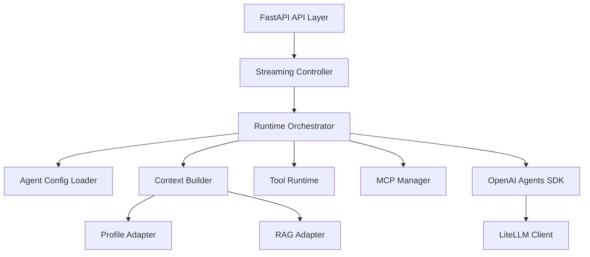
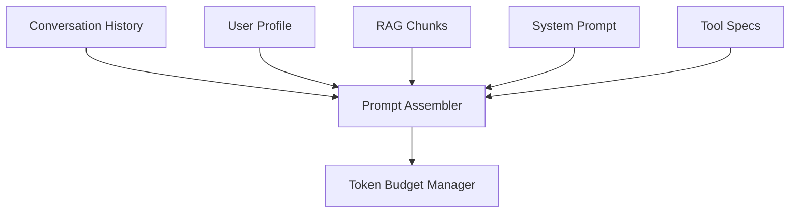
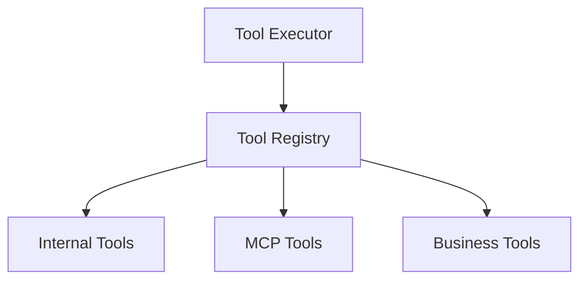
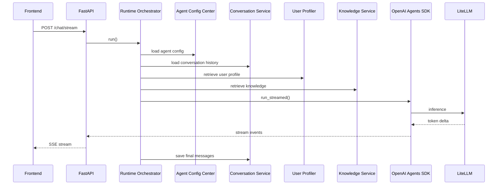

# Agent Runner Architecture Design

## 1. Overview

`Agent Runner` 是整个 AI Runtime Platform 的核心运行时组件。

它负责：

* Agent 执行
* Context 构建
* Tool 调度
* MCP 生命周期管理
* LLM 推理调用
* Streaming 输出
* Cancellation 管理

但它：

**不负责长期状态存储。**

---

## 2. 在整体架构中的定位

在当前整体系统中：

```text
User Terminal
    ↓
Gateway
    ↓
Agent Runner
```

Agent Runner 依赖：

| 服务                              | 用途             |
| ------------------------------- | -------------- |
| Conversation Management Service | 聊天记录 / Context |
| User Profiler Service           | 用户画像           |
| Knowledge Service               | RAG Retrieval  |
| Agent Configuration Center      | Agent 配置       |
| LLM Gateway                     | 模型调用           |

---

## 3. Agent Runner 的职责边界

### 属于 Agent Runner 的职责

| 功能                   | 说明              |
| -------------------- | --------------- |
| Request lifecycle    | 管理单次 generation |
| Context assembly     | 构建上下文           |
| Tool orchestration   | Tool 调用         |
| MCP lifecycle        | MCP 管理          |
| Streaming            | SSE Streaming   |
| Model invocation     | 调用 LiteLLM      |
| Runtime cancellation | 请求取消            |
| Agent execution      | Agent Runtime   |

---

### 不属于 Agent Runner 的职责

| 功能               | 原因                         |
| ---------------- | -------------------------- |
| 用户体系             | User Service               |
| Conversation 持久化 | Conversation Service       |
| Vector DB        | Knowledge Service          |
| Agent 配置存储       | Agent Configuration Center |
| RAG 数据管理         | Knowledge Service          |
| 长期用户状态           | User Profiler Service      |

---

# 4. Agent Runner 内部架构



---

# 5. 核心模块设计

---

## 5.1 FastAPI API Layer

负责：

* HTTP API
* SSE Endpoint
* Request Lifecycle
* Authentication
* Request Validation

推荐：

```python
POST /v1/agent/chat/stream
```

返回：

```http
Content-Type: text/event-stream
```

---

## 5.2 Streaming Controller

负责：

* SSE Streaming
* Event 转换
* Delta 输出
* Tool Event 输出
* Connection Lifecycle

推荐事件模型：

```json
{
  "type": "token_delta",
  "content": "hello"
}
```

```json
{
  "type": "tool_start",
  "tool": "search_docs"
}
```

```json
{
  "type": "tool_result",
  "tool": "search_docs"
}
```

---

## 5.3 Runtime Orchestrator

Agent Runner 的核心协调器。

负责：

| 功能               | 说明                   |
| ---------------- | -------------------- |
| 加载 Agent Config  | Agent Definition     |
| 构建 Context       | Prompt Assembly      |
| 初始化 Tool Runtime | Tool Registry        |
| 初始化 MCP          | MCP Connections      |
| 创建 SDK Agent     | OpenAI Agents SDK    |
| 管理 Streaming     | Stream Events        |
| 管理 Cancellation  | Request Cancellation |

---

## 5.4 Agent Config Loader

从 Agent Configuration Center 加载 Agent Definition。

推荐配置模型：

```json
{
  "agent_id": "support_agent",
  "version": "v3",

  "model": "gpt-4.1",

  "system_prompt": "...",

  "tools": [
    "search_docs",
    "create_ticket"
  ],

  "mcp_servers": [
    "slack",
    "notion"
  ],

  "memory_policy": {
    "profile": true,
    "rag": true
  }
}
```

---

## 5.5 Context Builder

负责：

* Conversation History
* User Profile
* RAG Retrieval
* Prompt Assembly
* Token Budgeting
* Context Truncation

内部结构：



---

## 5.6 Tool Runtime

统一 Tool 调度层。

支持：

| Tool 类型        | 示例                  |
| -------------- | ------------------- |
| Internal Tools | create_ticket       |
| MCP Tools      | slack/github/notion |
| Business Tools | CRM/ERP             |

内部结构：



---

## 5.7 MCP Manager

负责：

* MCP Connection Pool
* MCP Lifecycle
* Tool Discovery
* MCP Session Management

推荐：

不要每个请求新建 MCP 连接。

应维护：

```text
Connection Pool
```

---

## 5.8 OpenAI Agents SDK Runtime

Agent Runner 内部使用：

```text
openai-agents-python
```

作为 Runtime Kernel。

推荐：

```python
agent = Agent(
    name=...,
    instructions=...,
    tools=...,
    model=...
)
```

执行：

```python
result = Runner.run_streamed(
    agent,
    input=context
)
```

---

## 5.9 LiteLLM Gateway

统一模型抽象层。

支持：

* OpenAI
* Claude
* Gemini
* DeepSeek
* Qwen
* vLLM
* Ollama

Agent Runner 不直接耦合具体模型厂商。

---

# 6. 请求生命周期



---

# 7. Cancellation 设计

推荐：

基于 HTTP Request Lifecycle。

即：

```text
HTTP connection lifecycle
==
generation lifecycle
```

推荐实现：

```python
await request.is_disconnected()
```

或：

```python
asyncio.CancelledError
```

推荐：

```python
try:
    async for event in result.stream_events():
        yield sse(event)

except asyncio.CancelledError:
    await cleanup()
    raise
```

---

# 8. Streaming 设计

推荐：

```text
SSE (Server Sent Events)
```

而不是 WebSocket。

原因：

当前模型：

```text
request -> streaming response
```

是单向流。

不需要双向实时协议。

---

# 9. 推荐目录结构

```text
agent_runner/

├── api/
│   ├── routes.py
│   └── streaming.py

├── runtime/
│   ├── orchestrator.py
│   ├── cancellation.py
│   ├── events.py
│   └── lifecycle.py

├── context/
│   ├── builder.py
│   ├── truncation.py
│   ├── prompt_assembler.py
│   ├── profile_adapter.py
│   └── rag_adapter.py

├── agents/
│   ├── loader.py
│   ├── config_models.py
│   └── factory.py

├── tools/
│   ├── registry.py
│   ├── executor.py
│   ├── internal/
│   ├── business/
│   └── mcp/

├── mcp/
│   ├── manager.py
│   ├── pool.py
│   └── lifecycle.py

├── llm/
│   └── litellm_client.py

├── sdk/
│   └── openai_runtime.py

└── observability/
    ├── tracing.py
    ├── logging.py
    └── metrics.py
```

---

# 10. 核心设计原则

---

## 10.1 Runtime 与 State 分离

Agent Runner：

不持久化长期状态。

长期状态：

由：

* Conversation Service
* User Profiler Service
* Knowledge Service

负责。

---

## 10.2 SDK 是 Runtime Kernel

OpenAI Agents SDK：

是 Runtime 内核。

但：

不是整个系统架构。

---

## 10.3 CAS 内部模块化，但不微服务化

Agent Runner：

内部：

* 模块化
* 单进程

不要：

* 内部 RPC
* 内部微服务拆分

否则会形成：

```text
Runtime RPC Storm
```

---

## 10.4 Conversation / Knowledge / Profile 分层

| 类型                 | 来源                    | 生命周期           |
| ------------------ | --------------------- | -------------- |
| Conversation       | Conversation Service  | 短期             |
| Profile            | User Profiler Service | 长期             |
| Knowledge          | Knowledge Service     | 外部知识           |
| Runtime Scratchpad | Agent Runner          | Request Scoped |

---

# 11. 最终定位

Agent Runner：

本质上是：

```text
Request-scoped Agent Runtime Host
```

而不是：

```text
Chat Backend
```

它是：

整个 AI Runtime Platform 的推理执行核心。
